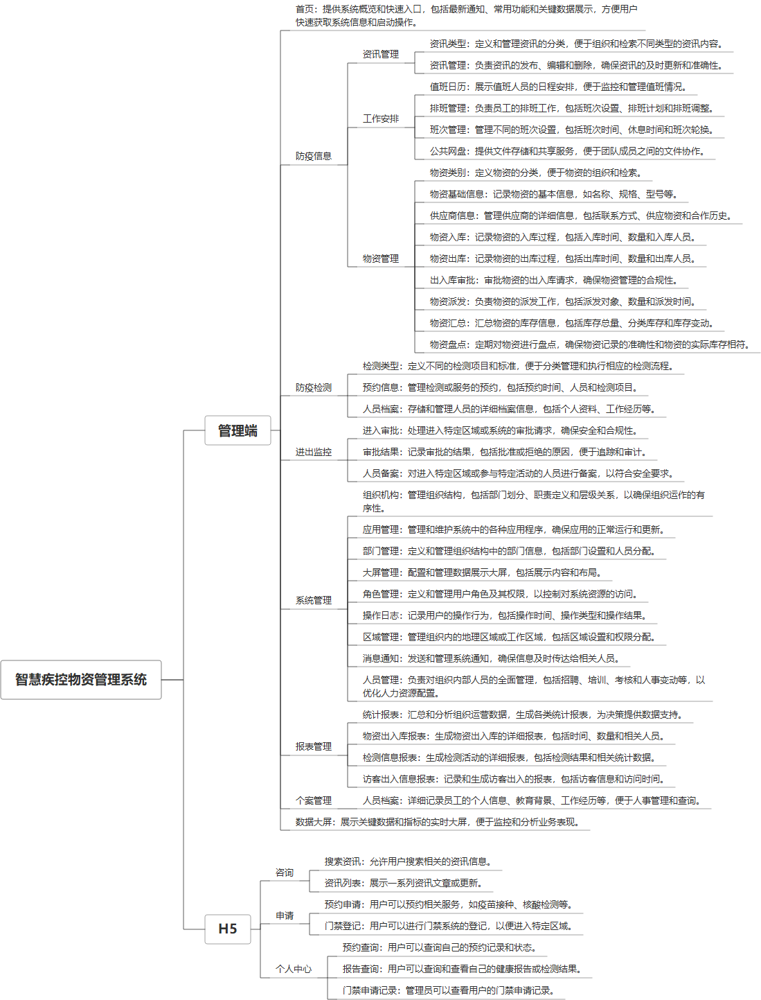

 

    
 

公司拥有上百套具有自主知识产权的软件系统，详情请查看码云首页或公司官网

 
<h1>智慧疾控物资管理</h1>

<a href="https://www.haishi.net.cn/">公司官网</a> ｜ <a href="https://www.haishi.net.cn/">在线体验</a>

 

## 系统介绍

防疫物资管理系统是一款集区域管理、防疫信息、物资管理于一体的综合性系统。它涵盖了防疫检测、进出监控、人员档案、部门管理等多项功能，能够实现对防疫物资的入库、出库、审批、派发、汇总和盘点等全流程管理。同时，系统还提供了工作安排、排班管理、数据大屏、统计报表等辅助功能，确保防疫物资的高效利用和实时监控
防疫物资管理系统是一款集区域管理、防疫信息、物资管理于一体的综合性系统。它涵盖了防疫检测、进出监控、人员档案、部门管理等多项功能，能够实现对防疫物资的入库、出库、审批、派发、汇总和盘点等全流程管理。同时，系统还提供了工作安排、排班管理、数据大屏、统计报表等辅助功能，确保防疫物资的高效利用和实时监控
本项目名称为智慧疾控物资管理系统，是一款用于疾控物资管理的系统。该系统主要涵盖了防疫信息管理、物资管理、防疫检测管理、人员出入监控、系统管理和报表管理六大模块。
- 防疫信息管理：提供资讯管理、工作安排（值班日历、排班管理、班次管理、公共网盘）等功能，方便进行防疫信息的发布和管理。
- 物资管理：涵盖了物资类别、物资基础信息、供应商信息、物资入库、物资出库、出入库审批、物资派发、物资汇总和物资盘点等功能，实现对物资的精细化管理。
- 防疫检测管理：包括检测类型、预约信息和人员档案管理，方便进行防疫检测工作的开展和管理。
- 人员出入监控：提供进入审批、审批结果和人员备案等功能，实现对人员出入的有效监控和管理。
- 系统管理：包括组织机构、部门管理、大屏管理、角色管理、消息通知和人员管理等功能，保障系统的正常运行和维护。
- 报表管理：提供统计报表、物资出入库报表、检测信息报表和访客出入信息报表等功能，方便进行数据统计和分析。
                

## 系统功能介绍

### 系统包含终端说明

管理端（WEB）、用户端（H5）

| 序号 | 模块                | 模块说明 |
| ---- | ------------------- | -------- |
| 1    | ZF-WZGL-ZHJK-SERVER | 服务端   |
| 2    | ZF-WZGL-ZHJK-H5     | H5端     |
| 3    | ZF-WZGL-ZHJK-MANAGE | 管理端   |

### 系统功能结构

### 系统功能说明

- 物资管理：系统提供物资类别、物资基础信息、供应商信息、物资入库、物资出库、出入库审批、物资派发、物资汇总和物资盘点等功能，实现对物资的精细化管理，对于疾控物资管理至关重要。
- 防疫信息管理：提供资讯管理、工作安排等功能，方便进行防疫信息的发布和管理，对于疫情防控工作至关重要。
- 防疫检测管理：包括检测类型、预约信息和人员档案管理，方便进行防疫检测工作的开展和管理，对于疫情防控工作至关重要。
- 人员出入监控：提供进入审批、审批结果和人员备案等功能，实现对人员出入的有效监控和管理，对于疫情防控工作至关重要。
- 报表管理：提供多种报表功能，方便进行数据统计和分析，对于疫情防控决策至关重要。

## 系统主要界面

## 系统技术说明

### 代码模块说明

| 序号 | 目录                      | 目录说明 |
| ---- | ------------------------- | -------- |
| 1    | ZF-WZGL-ZHJK-SERVER/.idea | --       |
| 2    | ZF-WZGL-ZHJK-SERVER/src   | --       |

### 系统技术选型

#### 开发语言/框架

JAVA（JDK1.8）
前端框架：VUE2
前端框架：TS

#### 服务中间件

Nginx
Tomcat

#### 数据库

MySQL（5.7+）

#### 其他说明

无

## 系统演示/商用

请扫码添加客服微信获取演示地址和系统详细资料。

如果您想基于智慧疾控物资管理进行商业化交付或定制开发服务，我们提供有偿的技术服务支持，合作模式不限，欢迎沟通！

公司官网地址： <a href="https://www.haishi.net.cn/">https://www.haishi.net.cn</a>

联系客服获取专业回答。

## 使用须知

1、 本项目商用必须获得版权所有者的授权。

2、 未经允许本项目代码不允许二次出售。

